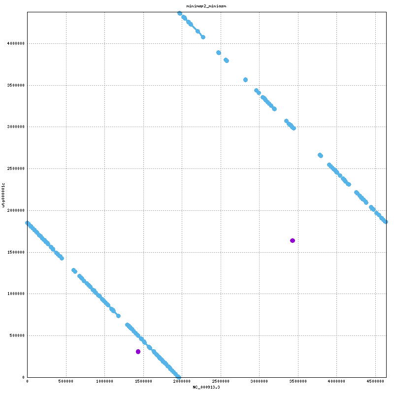
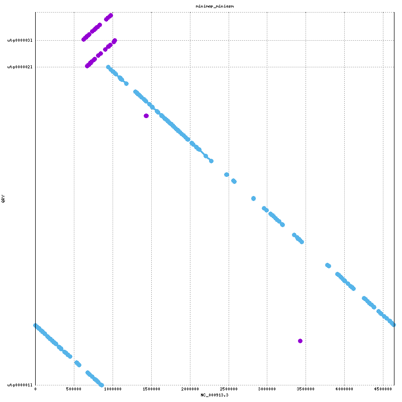
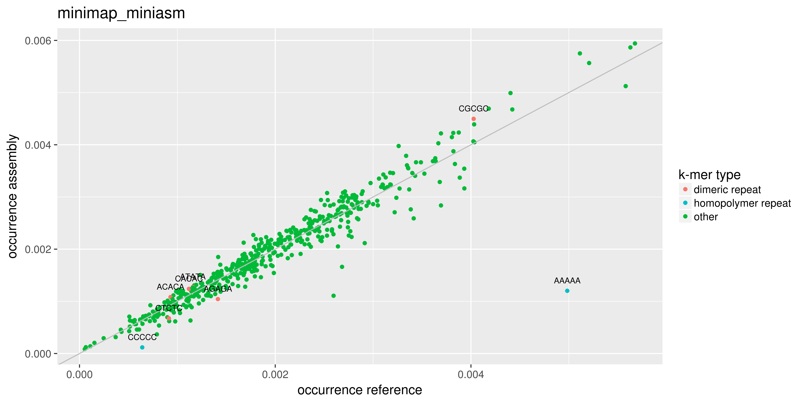
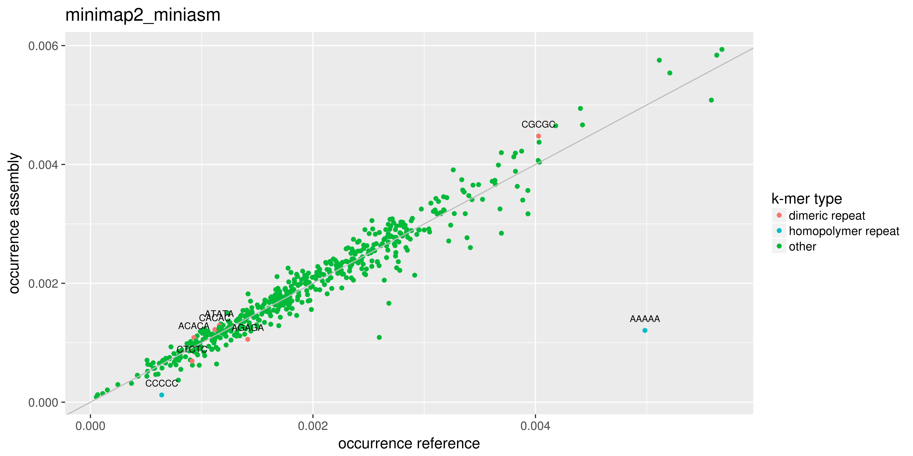

<h1>Assembler benchmark for ONT MinION data</h1><h4>Dr. Ackula</h4>Based on a <a href="github.com/cvdelannoy/MinIONAssemblerBenchmark"> benchmarking routine </a> by Carlos de Lannoy<h2>Abstract</h2>The MinION is a portable DNA sequencer that generates long error-prone reads. As both the hardware and analysis software are updated regularly, the most suitable tool for subsequent analyses of a dataset generated with a given combination of hardware and software for a given organism is not always clear. Here we present a benchmark for a selection of <i>de novo</i> assemblers available to MinION users, on a read set of <i>Escherichia coli</i>. This benchmark is based on a <a href="">benchmarking routine</a>, designed to facilitate easy replication on a read set of choice and addition of other <i>de novo</i> assembly pipelines.

<h2>Results</h2><h3>Readset quality</h3>
<table>
<thead>
<tr><th style="text-align: center;">                   </th><th style="text-align: center;"> Absolute  </th><th style="text-align: center;">  %  </th></tr>
</thead>
<tbody>
<tr><td style="text-align: center;">     Identity      </td><td style="text-align: center;">5.7772e+06 </td><td style="text-align: center;">79.56</td></tr>
<tr><td style="text-align: center;">    Mismatches     </td><td style="text-align: center;">  543106   </td><td style="text-align: center;">7.48 </td></tr>
<tr><td style="text-align: center;">    Insertions     </td><td style="text-align: center;">  740341   </td><td style="text-align: center;">10.2 </td></tr>
<tr><td style="text-align: center;">     Deletions     </td><td style="text-align: center;">  201001   </td><td style="text-align: center;">2.77 </td></tr>
<tr><td style="text-align: center;">    Total bases    </td><td style="text-align: center;">8.68313e+08</td><td style="text-align: center;">     </td></tr>
<tr><td style="text-align: center;">Median read quality</td><td style="text-align: center;">   11.2    </td><td style="text-align: center;">     </td></tr>
<tr><td style="text-align: center;">  Read length N50  </td><td style="text-align: center;">   62541   </td><td style="text-align: center;">     </td></tr>
<tr><td style="text-align: center;"> Mean read quality </td><td style="text-align: center;">   10.7    </td><td style="text-align: center;">     </td></tr>
</tbody>
</table><h3>Assembler performance</h3><table>
<thead>
<tr><th style="text-align: center;"> Assembler &zwnj; </th><th style="text-align: center;"> Contigs &zwnj; </th><th style="text-align: center;"> N50 &zwnj; </th><th style="text-align: center;"> NA50 &zwnj; </th><th style="text-align: center;"> mismatches (/100kb) </th><th style="text-align: center;"> indels (/100kb) </th><th style="text-align: center;"> Reference cov. (%) </th><th style="text-align: center;"> Genes &zwnj; </th><th style="text-align: center;"> CPU time </th></tr>
</thead>
<tbody>
<tr><td style="text-align: center;">  minimap2_miniasm   </td><td style="text-align: center;">         1         </td><td style="text-align: center;">    4375901    </td><td style="text-align: center;">      7010      </td><td style="text-align: center;">         1.026          </td><td style="text-align: center;">         0          </td><td style="text-align: center;">      0 + 1 part       </td><td style="text-align: center;">     3343.47     </td><td style="text-align: center;">   0:38:48   </td></tr>
<tr><td style="text-align: center;">   minimap_miniasm   </td><td style="text-align: center;">         3         </td><td style="text-align: center;">    4292887    </td><td style="text-align: center;">      7010      </td><td style="text-align: center;">         1.077          </td><td style="text-align: center;">         0          </td><td style="text-align: center;">      1 + 2 part       </td><td style="text-align: center;">     3311.35     </td><td style="text-align: center;">   0:21:12   </td></tr>
</tbody>
</table><h3>synteny plots</h3>

<h3>k-mer plots</h3>

